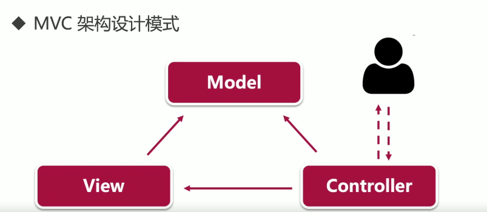
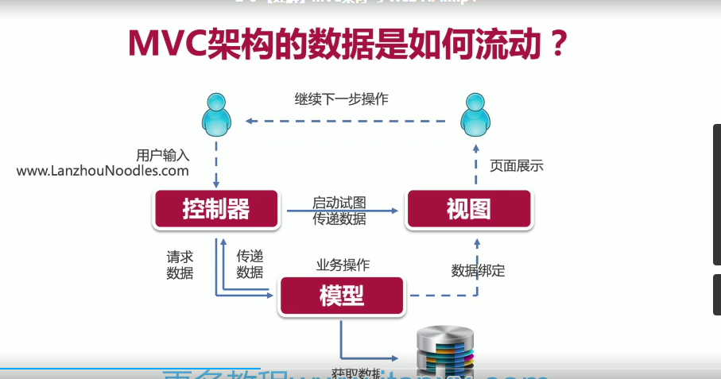
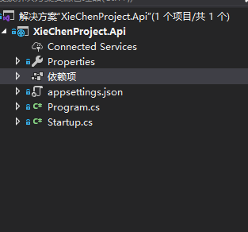
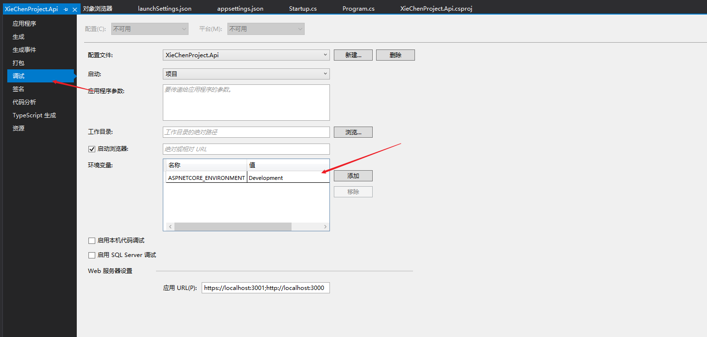

## 什么是 .NET Core

开源 跨平台 轻量级

.NET Core 3.0 以后版本都是命名 .NET5

## 性能

轻量级

适合微服务架构

容器化

但并不向后兼容


## Asp.Net Core MVC




### Model 模型

​    MVC 架构的核心，表示业务模型或数据模型，业务逻辑，如算法实现，数据的管理，输出对象的封装等等

### Controller  控制器

​    接受用户的输入，并调用模型和视图去完成用户的请求处理，不处理数据，返回视图，显示数据

### View  视图

​    显示给客户页面暂时

### MVC架构的数据是如何流动的

  

MVC的每个部分都是紧密结合的，它的核心并不是解耦，而是重用

只有调用关系 没有层级关系

### MVC优点

降低耦合性

可复用性高

可维护性高

### MVC缺点

定义不明确，学习曲线陡

结构复杂

数据流动性效率低

## Asp.Net Core 项目结构




**依赖项**：项目所有依赖包和主键都在这个文件里面进行关联

**appsettings.json** 项目运行时设置 ，托管服务器设置

**Properties.lunchSetting.json** 设置项目的启动信息

**Program.cs**  

**Startup.cs**

Core 独有的 KESTREL ，可以跨平台

#### Program.cs 文件说明

```c#
public class Program
{
    public static void Main(string[] args)
    {
         CreateHostBuilder(args).Build().Run();
    }

    public static IHostBuilder CreateHostBuilder(string[] args) =>
        Host.CreateDefaultBuilder(args)
        .ConfigureWebHostDefaults(webBuilder =>
         {
             webBuilder.UseStartup<Startup>();
         });
}
```

.net core 项目是通过Main 方法 调用 <font color=#FF000>CreateHostBuilder(args).Build().Run();</font> 这个句代码其他Croe 项目的虚拟机


#### Startup.cs 文件说明

```c#
public class Startup
    {
        // This method gets called by the runtime. Use this method to add services to the container.
        // For more information on how to configure your application, visit https://go.microsoft.com/fwlink/?LinkID=398940
        public void ConfigureServices(IServiceCollection services)
        {
        }

        // This method gets called by the runtime. Use this method to configure the HTTP request pipeline.
        public void Configure(IApplicationBuilder app, IWebHostEnvironment env)
        {
            if (env.IsDevelopment())
            {
                app.UseDeveloperExceptionPage();
            }

            app.UseRouting();

            app.UseEndpoints(endpoints =>
            {
                endpoints.MapGet("/", async context =>
                {
                    await context.Response.WriteAsync("Hello World!");
                });
            });
        }
    }
```

##### ConfigureServices 方法

在 ConfigureServices 方法里面 配置 各种服务的组件和依赖，他是程序运行时创建

###### Configure 方法

在 Configure  方法中 设置中间件 设置请求通道 配置HTTP请求通道

Request Pipeline

1.检查 处理 http请求

2.交由中间件（Middleware）处理，

​    Logging -> Static Files ->MVC 

可以对请求短路处理 

###### IApplicationBuilder 参数

  这个参数是配置中间件

###### IWebHostEnvironment 参数

配置的环境变量

在属性的 调式 里面 环境变量 里面去设置




### Entity Framework Core

跨平台，建模，允许使用linq 查询 更改 保存数据

并发 乐观锁，事务，缓存，数据迁移

#### EF的组件

 LINQ 

Entity SQL

Object Service 对象服务

Data Provider 数据供应

ADO.NET 数据库通讯


